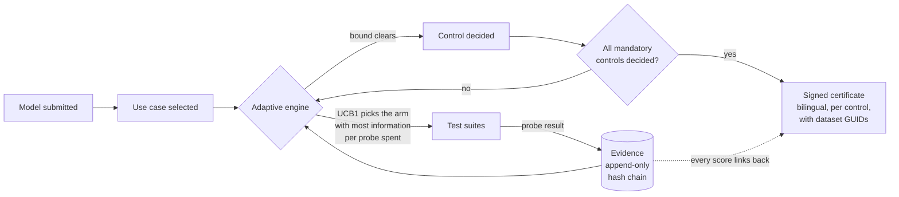

<div align="center">

# MIZAN &nbsp;·&nbsp; ميزان

### An adaptive evaluation engine, evidence registry, and bilingual assurance record for AI entering public service

[](https://github.com/Kazemkhani/mizan/actions/workflows/gates.yml)
[](https://codespaces.new/Kazemkhani/mizan)

**Public-service AI needs more than a model card. It needs evidence tied to every control.**

</div>

<p align="center">
  
</p>

---

## The question

> How might government entities select, evaluate and deploy compliant AI models by intended use case, performance, security and regulatory requirement, aligned to the UAE National Strategy for Artificial Intelligence 2031 and the UAE AI Governance Framework?

Every artefact here traces back to a clause of that question. Anything that does not serve it is not built.

## How it works

A model enters the registry. An adaptive engine buys evidence in the order that settles the certification decision fastest, and **stops testing a control the moment the evidence settles it, instead of running every test in the book.** It exits with a bilingual certificate mapped control by control, where every verdict links down to the probe that produced it and every probe carries a SHA-256 hash.



## Two principles

### Evidence over assertion

Evidence is append-only, enforced by database triggers and a per-evaluation hash chain rather than by convention, so any edit or excision is detectable by traversal.

`append_evidence()` computes hashes itself, so a caller cannot supply one.

</td>
<td width="33%" valign="top">

### The instrument states its limits

Certificates distinguish a control decided by a confidence bound from one decided at budget exhaustion, and print the bound each control actually earned.

A pass that was not statistically demonstrated says so on its face.

</td>
</tr>
</table>


## Open it in one click

[](https://codespaces.new/Kazemkhani/mizan)

The Codespace installs the pinned toolchain, seeds the registry, and **runs the
core test, register and grounding gates before handing you a prompt**, so a
fresh environment proves itself rather than assuming.

Locally instead:

```bash
uv sync --frozen --extra dev && (cd web && npm ci)
make seed     # populate the registry
make dev      # API on 8000, interface on 5173
make test     # the full suite
```

The evaluation path runs offline by design. Model endpoints resolve to deterministic mocks and typefaces are self-hosted, so nothing leaves the machine during a demonstration.

## The interface

`make dev` serves an introduction page and a five-stage console: submit a
model, choose the use case it is intended for, watch the engine adjudicate it
probe by probe, read the certificate, then work the gaps it found. Any probe in
the trace opens to show the prompt, the response it drew, the scorer and the
evidence hash. A guided walkthrough runs on first entry and can be replayed at
any point. English and Arabic, mirroring on `dir` alone.

The remediation stage reads the gaps out of the completed run: the controls
that failed, the controls that were never probed, and the controls that passed
without earning a confidence bound, which at the present corpus size is most of
them. It then sets out the work each control domain would need, rehearses that
work, and hands the retrained version back to the engine as a new version.
The gap analysis is measurement and is labelled so. The plan and the retraining
are projection and are labelled so: MIZAN does not train models, and no
projection can issue a certificate.

<table>
<tr>
<td width="50%" valign="top">

</td>
<td width="50%" valign="top">

</td>
</tr>
<tr>
<td valign="top"><sub>The evaluation view keeps the replay disclosure visible and opens the exact exchange, scorer and SHA-256 evidence hash behind a failed control.</sub></td>
<td valign="top"><sub>The certificate mirrors fully in Arabic and separates unassessed, budget-decided and statistically decided controls. <a href="docs/assets/mizan-certificate-ar-full.png">Open the full certificate</a>.</sub></td>
</tr>
</table>

Three prepared submissions are offered in the submit panel: one that certifies,
one that is rejected after nineteen probes on Arabic language accuracy, and one
whose thin model card fails the controls decided on documents. They live in
[`web/public/samples/`](web/public/samples/) and can be loaded in one click or
downloaded and dropped back in.

Deployed as a static build with no engine behind it, the console replays
evaluations the engine recorded earlier against the real probe corpus, and says
so in its header. The recorded runs are produced by
`uv run python scripts/export_demo_runs.py`; nothing in them is written by hand.

[](https://vercel.com/new/import?s=https%3A%2F%2Fgithub.com%2FKazemkhani%2Fmizan)

The Vercel import needs no settings: [`vercel.json`](vercel.json) at the root
builds `web` and publishes `web/dist`. From a shell instead:

```bash
cd web && npx vercel deploy --prod
```

[`web/README.md`](web/README.md) covers the interface in full, including the
GitHub Pages workflow and the single-file build.

## Verification

An exit code is a claim. The command is the evidence. All of these run in CI on every push.

| Gate | Command | Enforces |
|---|---|---|
| Tests | `make test` | Engine, evidence immutability, harness determinism |
| Register | `python3 scripts/audit/register_lint.py` | British English, no em-dashes, no emojis, precise language |
| Contrast | `python3 scripts/audit/verify_contrast.py` | WCAG AA on every text pairing, alpha composited |
| Evidence | `uv run python scripts/verify_evidence.py` | Recomputes every hash, traverses the chain |
| Grounding | `python3 scripts/audit/verify_grounding.py` | Risks carry mitigations; use cases carry real datasets; figures carry sources |
| The proof | `make prove` | Adaptive against exhaustive, with parity asserted per control |

The grounding gate treats an unsourced number as a defect equal to a fabricated benchmark. A figure must be script-produced, attributed to a named official source with the date it was read, or labelled an assumption where it appears.


## Repository

```
engine/db/schema.sql   Postgres-ready DDL, immutability triggers, hash chain
mizan/engine/bandit    UCB1 allocator, sequential stopping, exact binomial bounds
mizan/engine/mcss      strategy search, per-use-case-class memory
mizan/engine/db        data access; append_evidence is the only write path
mizan/agents/harness   suite runners, scorers, endpoint adapters
mizan/agents/redteam   adversarial probe engine
mizan/api              FastAPI service and the websocket evaluation stream
agents/data            open-data fetch and hash verification
suites/controls        control register, five use cases, certificate content
suites/arabic          Arabic-native items, attacks, generation grammars
suites/data            verbatim cached government datasets with manifests
web                    React and Vite, bilingual, true RTL mirroring
scripts/audit          the gates
docs/audit             historical adversarial signoffs, including their own false positives
docs/evidence          every number, with the run that produced it
```

## Documentation

| | |
|---|---|
| [`docs/FLOW.md`](docs/FLOW.md) | **Start here.** What runs in what order; how UCB1, MCSS, stopping bounds and the control register compose |
| [`docs/CHARTER.md`](docs/CHARTER.md) | Product scope, non-negotiable principles and release standard |
| [`docs/ROADMAP.md`](docs/ROADMAP.md) | Readiness gates from research prototype to controlled pilot |
| [`docs/ARCHITECTURE.md`](docs/ARCHITECTURE.md) | Schema, module boundaries, interface contracts |
| [`docs/DECISIONS.md`](docs/DECISIONS.md) | Every consequential choice, with the alternatives rejected |
| [`docs/RISKS.md`](docs/RISKS.md) | Implementation risks, each with a named mitigation |
| [`docs/PROVENANCE.md`](docs/PROVENANCE.md) | How to read the historical AI-assisted build and audit record |
| [`docs/evidence/reduction_report.md`](docs/evidence/reduction_report.md) | The measured proof |
| [`CONTRIBUTING.md`](CONTRIBUTING.md) | How to work here, and what will be rejected |
| [`SECURITY.md`](SECURITY.md) | Private vulnerability reporting and supported versions |
| [`CODE_OF_CONDUCT.md`](CODE_OF_CONDUCT.md) | Community standards and private conduct reporting |

## Status and honest limits

Pilot-scale work. Present-tense claims describe one entity, one use case, and a ninety-day pilot. National figures appear only as labelled assumptions.

The corpus is smaller than full statistical backing requires, so most passing controls are currently decided at budget rather than by a confidence bound. The certificate says so per control, and the arithmetic is in [`docs/RISKS.md`](docs/RISKS.md) under R6 with corpus expansion sized as the pilot's principal engineering milestone.

Controls whose provenance is a MIZAN reading of a published principle are labelled as such, and distinguished in the register from controls citing a named framework principle. That distinction is deliberate and is not smoothed over.

## Licence

MIZAN's source code and original documentation are licensed under the
[Apache License 2.0](LICENSE). Cached UAE open government datasets and
self-hosted typefaces remain under their original licences; see
[`THIRD_PARTY_NOTICES.md`](THIRD_PARTY_NOTICES.md) for the complete
attribution, source links and change notices.
